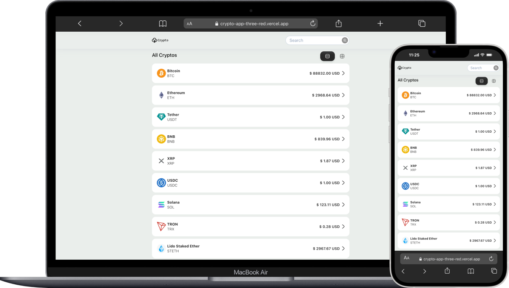

# Crypto app



## Overview

This project was developed with a strong focus on clarity, maintainability, and developer experience. Beyond delivering the required functionality, the goal was to design a solution that reflects how I think, how I break down problems, and how I leverage modern tools (including AI) to work efficiently.
This document explains the technical decisions, architecture, design choices, and trade-offs made during development.

> [!IMPORTANT]
> This project uses the [**api.coingecko.com**](https://www.coingecko.com) API because it provides more comprehensive information
> and fully meets the project requirements. Additionally, it allowed me to display richer data
> and better align with my design requirements.

---

## Getting Started

First, create `.env` file:

```
NEXT_PUBLIC_API_BASE_URL=https://api.coingecko.com/api/v3
NEXT_PUBLIC_API_KEY=CG-7uNyuA9yb9TdqgKJpneuJCYu
```

> [!IMPORTANT]
> Environment variables were added only to allow the project to run locally.
> They should never be public.

```bash

yarn install

yarn dev

```

Open [http://localhost:3000](http://localhost:3000) with your browser to see the result.

---

## Architecture & Tech Stack

### Tech Stack

- Framework:

  **React / Next.js**
  _Chosen for its component-based architecture, performance optimizations, and native support for Server Components and modern data-fetching patterns._

- Language:

  **TypeScript**
  _Used to ensure type safety, improve code readability, and reduce runtime errors, especially when working with API responses and shared models._

- State Management:

  **No global state management was required for the current scope of the project.**
  The application relies on local state and server-driven data.
  If global state were needed: - Redux for complex, large-scale state requirements - React Context for simpler shared state scenarios

- Data Fetching:

  **Native fetch with Next.js caching strategies**
  Used to leverage built-in caching, revalidation, and server-side data fetching capabilities.
  For larger or more complex applications:
  **React Query** would be the preferred choice to handle advanced caching, synchronization, and background updates.

- Styling:
  - Tailwind CSS:
    Used for rapid development, consistency, and utility-first styling.
  - Styled Components
    Applied in cases where:
    Complex animations are required
    Dynamic or advanced styles are not easily achievable with Tailwind alone
    This hybrid styling approach provides flexibility without sacrificing maintainability.

### Architecture

The folder structure was designed with scalability, clarity, and Next.js App Router best practices in mind. The main goal is to clearly separate UI concerns, data access, and shared logic, while also distinguishing between client and server components.

```graphql
app/
├── mocks/ # API data to implement test
├── (pages)/ # Pages grouped for better organization
├── components/ # Reusable UI client and server components
        ├── client # Only client components
                ├── common # General components used across different pages
                ├── feature # Components used by a specific page
        ├── icons # Global icons .tsx
        ├── server # Only server components
                ├── common # General components used across different pages
                ├── feature # Components used by a specific page
├── helpers/ # Utility functions that support different parts of the application
├── hooks/ # Custom hooks that encapsulate reusable stateful logic
├── interfaces/ # Centralized TypeScript interfaces and types for API responses and common data models
├── services/ # API calls and data fetching logic
```

### Why This Architecture

This folder structure was designed with clarity, scalability, and Next.js Server Components constraints in mind.
Clear Separation Between Server and Client Components
One of the key decisions was to explicitly separate Server Components and Client Components:

```graphql
app/
├── components/
    ├── client
    ├── server
```

This separation is intentional and critical in a **Next.js App Router** environment.
Using a single shared barrel file (`index.ts`) to export both server and client components can easily break Server Components, since importing a client component anywhere in the tree implicitly forces the entire module to become client-side.
By physically separating components into client and server folders:
Server Components remain pure and free of client-side dependencies
Accidental imports that could invalidate Server Components are avoided
The architecture makes the execution context (server vs client) explicit and self-documenting
This approach significantly reduces the risk of subtle runtime or build-time issues.

---

## AI Usage (Transparency)

AI tools were used intentionally as assistive tools, not as a replacement for reasoning or decision-making.

### Tools Used:

- ChatGPT
- (Optional: GitHub Copilot)

### How AI Was Used

- TypeScript Interfaces:
  Generated initial interfaces from API responses, then manually reviewed and refined.

- Debugging:
  Used AI to quickly identify possible causes of runtime or TypeScript errors and validate assumptions.
- Architecture & Refactoring Ideas:
  Brainstormed folder organization and component responsibilities.
- UX Copy / Naming:
  Helped refine variable names, component names, and UI text for clarity.
  All AI-generated output was reviewed, adjusted, and validated manually to ensure correctness and alignment with project goals.

---

## Design Decisions

During the design process, I explored multiple references and resources as a brainstorming exercise to validate ideas around layout, information hierarchy, and visual clarity. These references helped me identify common UI patterns and best practices that could be adapted to the needs of this application.

Some of the inspiration sources include:

[Dribbble](https://dribbble.com/search/dribble-crypro-app)

A mobile-first approach was applied from the beginning. Due to the nature of the application, most users are likely to access it from mobile devices, so the design prioritizes:

- Readability on small screens
- Clear information hierarchy
- Touch-friendly interactions

## Challenges Encountered

### API Limitations or Inconsistencies

Since the CoinGecko API is a paid service, it was necessary to limit the number of requests and implement caching strategies to avoid hitting rate limits.

### Time Constraints

Due to limited time, it was necessary to prioritize core functionality over secondary improvements or enhancements.

---

## Trade-offs

- Simplicity was prioritized over overly complex solutions.
- Some abstractions could be further refined, but code clarity and readability were favored.

---

## Possible Improvements

With more time, the following improvements could be made:

- Add unit and integration tests
- Improve empty states and error handling
- Optimize performance and component separation
- Add sorting options for lists
- Add more sections to the home page, such as top-ranked items
